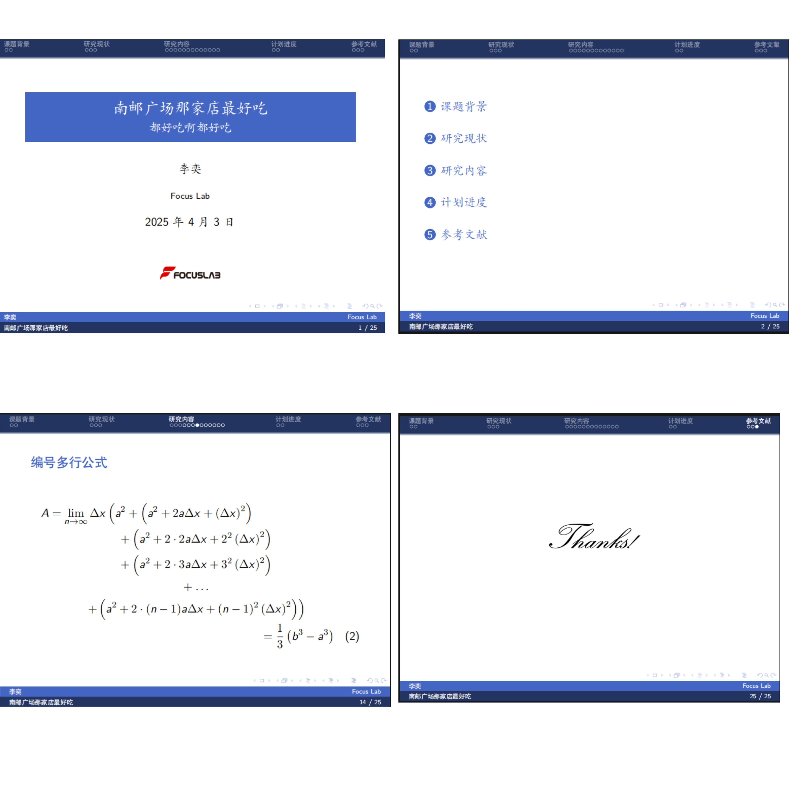

# FOCUSLAB-Beamer-Theme
focuslab 风格的 Beamer 主题，可用于答辩、汇报等

## Instructions

直接下载/导入本项目，编译方式选择 $Xe\LaTeX{}$

## Features

在 THU beamer 模板上作了一点修改：

:cherry_blossom: 使用Focuslab最爱用的focus蓝{RGB}{68,103,195} 标准色

:cherry_blossom: 更新 focuslab. logo

## Preview

## Acknowledgements
本项目基于 [THU-Beamer-Theme](https://github.com/tuna/THU-Beamer-Theme)，具体代码细节可参考此仓库
